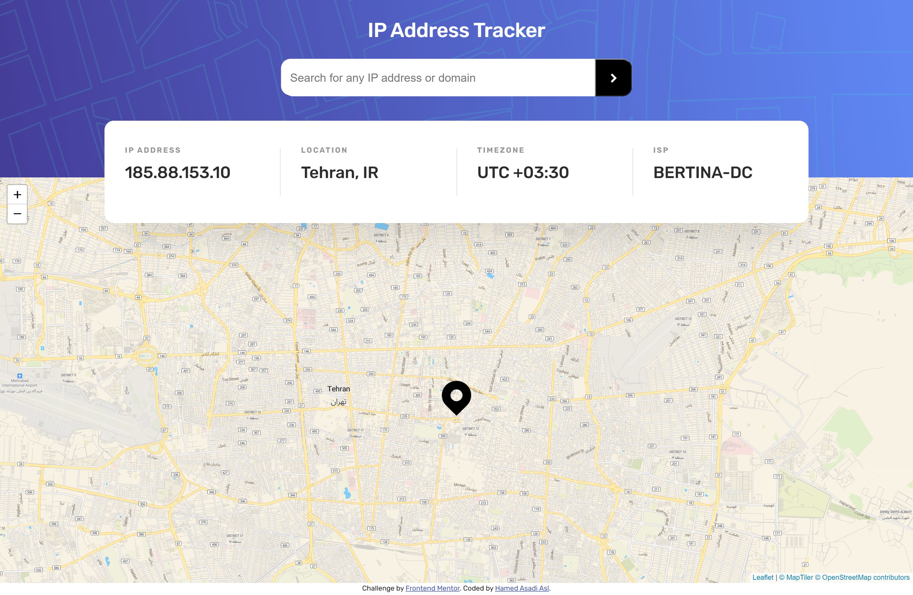

# IP address tracker

[IP address tracker challenge on Frontend Mentor](https://www.frontendmentor.io/challenges/ip-address-tracker-I8-0yYAH0).

### The challenge

The challenge is to build out this IP Address Tracker app.
- To get the IP Address locations, used the [IP Geolocation API by IPify](https://geo.ipify.org/).
- To generate the map, used [LeafletJS](https://leafletjs.com/).

Users could be able to:
- View the optimal layout for each page depending on their device's screen size
- See hover states for all interactive elements on the page
- See their own IP address on the map on the initial page load
- Search for any IP addresses or domains and see the key information and location

### Screenshot



### Links

- Live Site URL: [IP address tracker](https://hamed3958.github.io/IP-address-tracker/)

### Built with
- HTML5
- CSS
- JavaScript

### What I learned

- Using Fetch : [Web APIs > Fetch API](https://developer.mozilla.org/en-US/docs/Web/API/Fetch_API/Using_Fetch)

To see how can add code snippets, see below example:

```js
async function fetchData(queryType, queryValue) {
  const requestString = !queryType
    ? COMMON_ENDPOINT
    : `${COMMON_ENDPOINT}&${queryType}=${queryValue}`;

  return await fetch(requestString)
    .then(checkResponse)
    .then((data) => data)

    .catch((err) => {
      errorHandle(err.message);
    });
}
```

### Useful resources

- [Create a map with a marker using JavaScript](https://www.youtube.com/watch?v=wVnimcQsuwk) - This helped me to create the map.

## Author

- Website - [hamedasadiasl.ir](http://hamedasadiasl.ir/)
- Github - [@hamed3958](https://github.com/hamed3958)
- Frontend Mentor - [@hamed3958](https://www.frontendmentor.io/profile/hamed3958)
